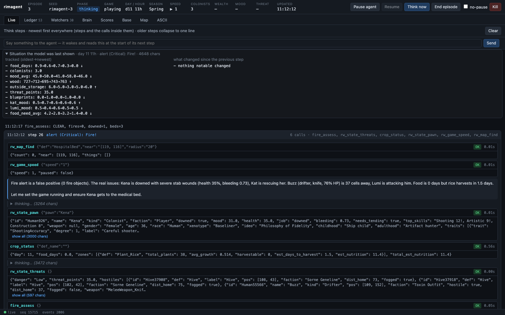
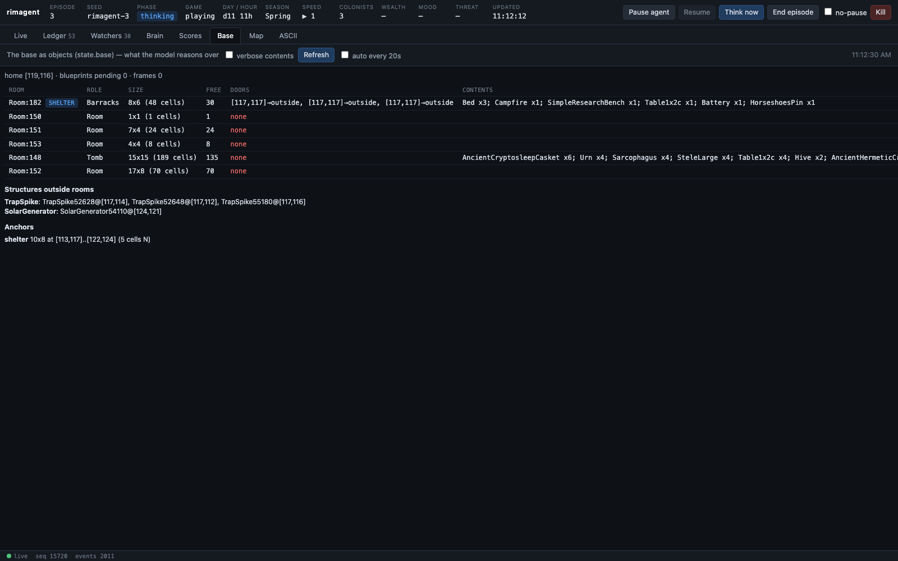
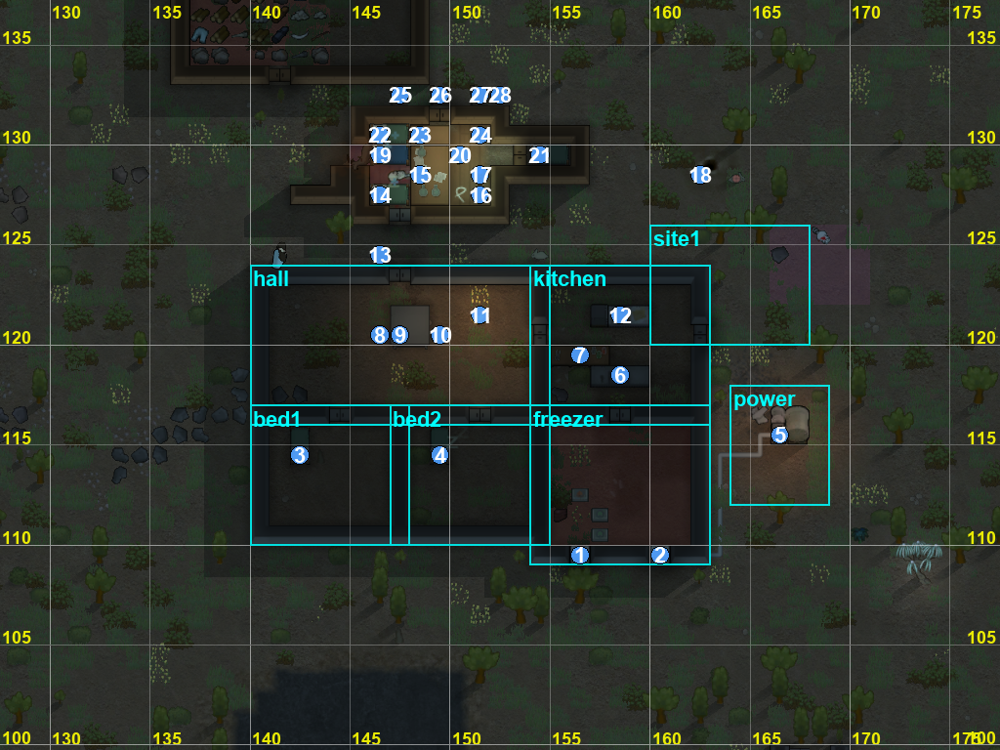

# rimagent

**An LLM that plays RimWorld — and rewrites its own playbook between colonies.**

A local model (tested with Qwen 3 27–32B on vLLM) runs a RimWorld colony through a mod that exposes the whole engine over HTTP. It sees the world as objects, trends and diffs rather than pixels or grids, controls the game with the same verbs a player has (right-click orders, gizmos, designators, blueprints, zones, dialogs, trade), and keeps everything it learns on disk: **skills** (markdown), **tools** and **watchers** (Python, hot-loaded), a journal, and a score per episode. Every colony ends in a reflection that edits those files and commits them. Then it starts the next one.

<p align="center"></p>

## What it looks like

| The base as the model sees it | Set-of-Mark screenshot (`look`) |
|---|---|
|  |  |

The *building camera* — every column numbered, one letter per building type (lowercase = blueprint), `*` = interaction spot that must stay clear:

```
      111111111111111111111111111111111111
      334444444444555555555566666666667777
      890123456789012345678901234567890123
 123  ..AAAAAAA+AAAAAAAAAAAAAAAT..........
 121  ..A....T.JJ..KT.A..LLL..A...........
 120  ..A.....HJJH.*..+......T+...........
 118  ..A.............A..GGG..A...........
 116  iiAAAA+AAAAAA+AAAAAA+AAAA..FDD......
 115  ..A.C....A.C...TAi.T....A...DD....T.
 110  ..AAAAAAAAAAAAAAA.......A.........T.
 109  T........T......AABAAABAA.......T..T
```
`A` walls · `B` coolers (in the freezer wall) · `C` beds · `D` generator · `F` battery · `G` butcher table · `H` chairs · `J` table · `K` campfire · `L` stove · `+` doors

The compound above was laid out through the same tools the model uses, with named anchors instead of coordinates:

```
rw_anchor_set(name="hall", rect=[140,116,15,8])
rw_ui_build_many(ops=[
  {"def":"Door","stuff":"Steel","at":"hall:N"},
  {"def":"Cooler","at":"freezer:S +W2","rot":"N"},
  {"def":"Wall","stuff":"Steel","rect":"hall"},
  {"def":"Bed","stuff":"WoodLog","at":"bed1:inset:1:NW +E1 +S1","rot":"N"},
  {"def":"FueledStove","at":"kitchen:inset:2:NW +E2","rot":"S"}])
```

## How it works

```
 ┌──────────────── RimWorld (Unity) ────────────────┐      ┌──────────────── rimagent (Python) ───────────────┐
 │ RimBridge mod (C#, Harmony)                      │      │ runner: episodes, wake triggers, pause-for-danger │
 │  game.*  state.*  map.*  ui.*  engine.*  defs.*  │◄────►│ loop: bounded tool-use step, fresh context each   │
 │  dev.*   anchor.*  dialogs   event ledger        │ HTTP │ tracker · world diff · scene graph · REPL         │
 │  off-screen camera (never moves your view)       │      │ watchers (fast reflexes, no LLM) on a poll tick   │
 └──────────────────────────────────────────────────┘      │ reflection → edits brain/ → git commit            │
                                                           │ dashboard (SSE) · operator chat                    │
                                                           └──────────────┬───────────────────────────────────┘
                                                                          │
                                        brain/  skills/*.md  tools/*.py  watchers/*.py  memory/  scores.jsonl
```

**Perception (what a think step opens with):** tracked values with trends (`food_days 9→7→5 ↓`, add your own engine path with `watch_add`), a harness-computed diff of the world since the last step, the base as rooms/doors/contents/problems (`state.base`), events, alerts, letters, open dialogs — then the raw numbers. Grids and pictures are on demand: `map.detail` (building camera), `map.view` (layers), `look` (screenshot with grid + numbered marks + anchor boxes).

**Control:** float-menu orders and gizmos (exactly what a player can click), designators, blueprints with a location grammar (`Campfire39256 +E2`, `@Gamble`, `bedroom2:NW`, `bedroom2:extend:E:4`, `Room:12`), zones/areas/storage, work priorities, schedules, policies, bills, research, letters and every window type (rituals, trade, naming, message boxes; a generic reader/answerer for anything else). `engine.get/set/call` reach any live object by path for the rest; the decompiled source is searchable so the model can find the right API itself.

**Learning:** an improvement pass on a second LLM stream every few days (turn repeated reactions into watchers, repeated computations into tools, tighten skills with numbers), an episode reflection at the end, per-episode scores, git history of `brain/`, `brain_revert` when a change made things worse. Tips you type in the dashboard are folded into skills.

**Knowledge:** the RimWorld wiki (scraped, BM25) and the decompiled game source (`search_source`, `read_source`) — it reads the actual raid-point formula rather than guessing.

## Quick start

Requirements: RimWorld 1.6 (tested on macOS/Steam with all DLCs), [Harmony](https://steamcommunity.com/sharedfiles/filedetails/?id=2009463077), .NET SDK 8+, [uv](https://docs.astral.sh/uv/), `rg` (ripgrep), and an OpenAI-compatible endpoint with native tool calls (vLLM: `--enable-auto-tool-choice --tool-call-parser hermes`; vision optional).

```bash
git clone https://github.com/zorrobyte/rimagent && cd rimagent
ln -s "$PWD/mod" "$HOME/Library/Application Support/Steam/steamapps/common/RimWorld/RimWorldMac.app/Mods/RimBridge"   # macOS path
script/build.sh                          # builds mod/1.6/Assemblies/RimBridge.dll
cd agent && uv sync && cd ..
cp config.yaml config.local.yaml         # put your llm.base_url / model in config.local.yaml
cd agent && uv run rimagent seed         # wiki → knowledge/wiki + BM25 (~10 min); decompile optional, see below
cd .. && script/start.sh                 # launches RimWorld via Steam if needed, starts the agent, opens the dashboard
```

Enable `RimBridge` in the mod list (after Harmony) the first time. Dashboard: http://127.0.0.1:8770 — Live (steps, the situation the model was shown, chat with the agent), Ledger, Watchers, Brain (skills/tools/watchers/memory + git history), Scores, Base, Map, ASCII.

Optional: decompile your own `Assembly-CSharp.dll` into `knowledge/source-1.6/` with [ilspycmd](https://github.com/icsharpcode/ILSpy) so the model can read the exact game code (`dotnet tool install -g ilspycmd; ilspycmd -p -o knowledge/source-1.6 <path to Assembly-CSharp.dll>`). Decompiled source is not part of this repo.

Useful commands: `rimagent think` (one step against the live game), `rimagent tools`, `rimagent llm "hi"`, `script/reload.sh` (save → restart game with a rebuilt mod → load → resume the agent), `curl localhost:8765/methods`.

## Repo layout

- `mod/` — RimBridge (C#). `Source/Engine` reflection + location grammar, `State` summaries + scene graph, `Map` ASCII/camera/screenshot, `Ui` player-parity controls + dialogs, `Ledger` Harmony event patches, `Dev` training tools. `mod/Tests` (xunit) for the pure parser.
- `agent/rimagent/` — runner, loop, registry (hot-loading tools/watchers), tracker, worlddiff, annotate (Set-of-Mark), reflect, skills/memory/scorecard, dashboard, knowledge (wiki/source), prompts.
- `brain/` — everything the agent authors (starts with 13 seeded skills: doctrine, the bridge manual, wiki-distilled strategy, and a worked base example).
- `docs/` — screenshots.

## Status

Early and very much alive: it loses colonies (fires, mech clusters, starvation), reflects, and comes back with new watchers and tighter skills. Cold-start play quality is the point — the interesting part is the slope. Contributions that make the *harness* see or act more faithfully are welcome; game strategy belongs in `brain/`, written by the agent.

## License

MIT. RimWorld is © Ludeon Studios; this project is an unofficial mod + agent and ships no game assets.
